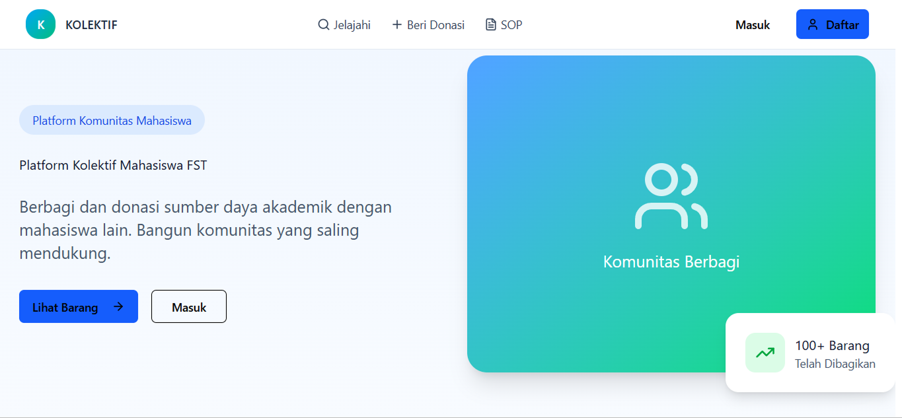
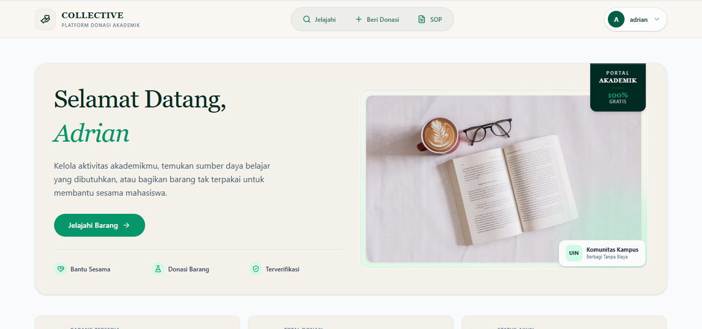
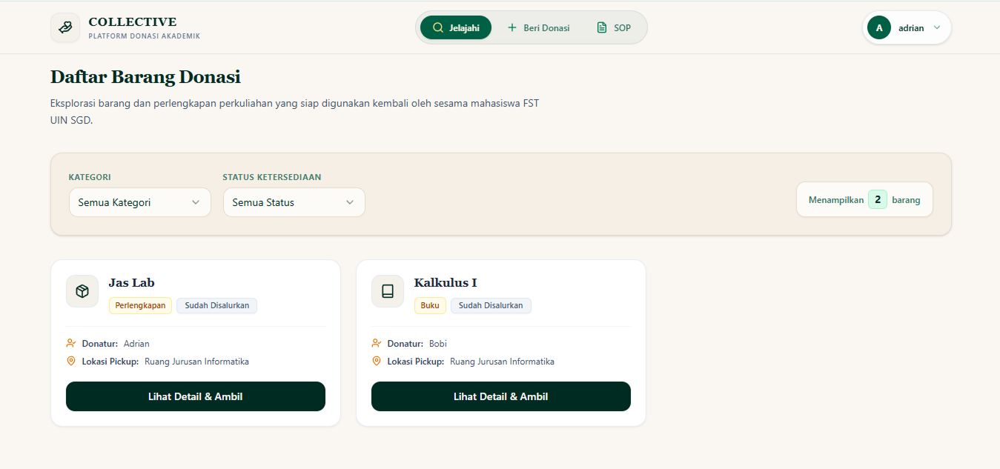
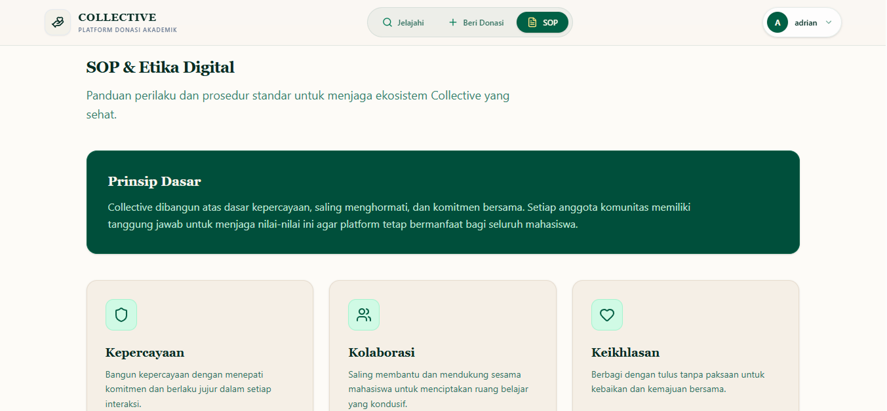
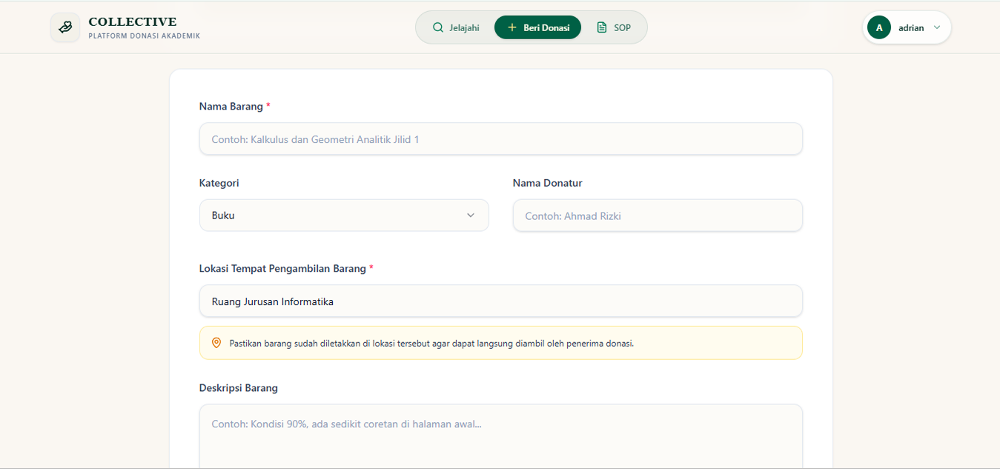
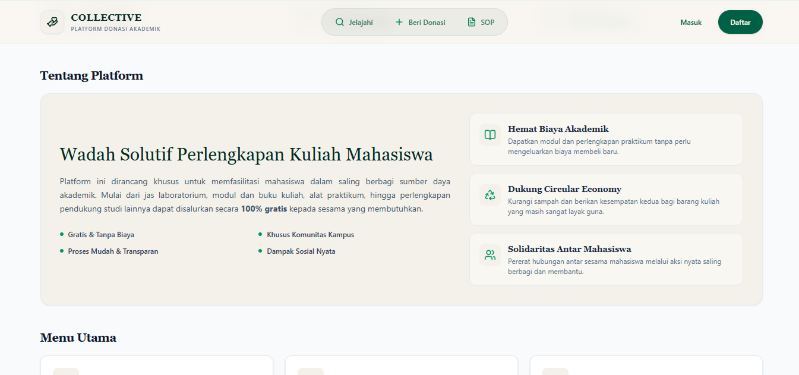
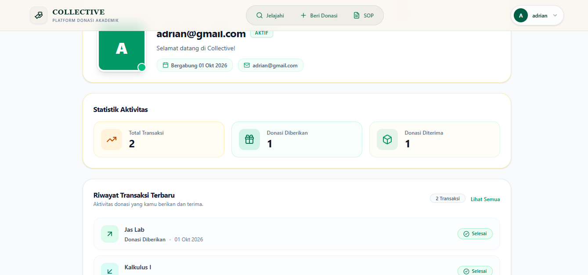

# Collective - Platform Donasi Perlengkapan Kuliah (Advanced Version)

<p align="center">
  
  
  
  
  
</p>

**Collective** adalah platform kolaboratif berbasis web yang memfasilitasi mahasiswa dalam saling berbagi, meminjamkan, maupun mendonasikan sumber daya serta perlengkapan akademik (seperti buku referensi, jas laboratorium, hingga alat praktikum) secara gratis untuk mendukung keberlanjutan studi antar sesama mahasiswa.

🌐 **Live Demo Application**: https://collective-fst.vercel.app

---

## 📌 Latar Belakang Proyek

> **Catatan Proyek Akademik & Pengembangan:**  
> Proyek ini berawal dari **Proyek Akhir Mata Kuliah Socio Informatics** yang diinisiasi oleh kelompok yang beranggotakan **Fadho Zurrahman**, **LM Irsal Shydiq**, **Yan Syafiq** dan **Danny Saputra**. 
> 
> Repositori ini merupakan **versi pengembang lanjut (Advanced Version)** yang dibangun kembali secara mandiri oleh **Fardho Zurrahman** guna meningkatkan kualitas arsitektur antarmuka (*UI/UX*), optimalisasi performa *build*, pembaruan basis kode (*re-architecting*), serta memperkaya fungsionalitas aplikasi secara menyeluruh.

### 🛠️ Rincian Peningkatan & Optimasi Teknis:
* **Perbaikan Backend & Database**: Menyelesaikan *error* koneksi Supabase, merapikan struktur skema tabel PostgreSQL, serta mengoptimalkan kebijakan keamanan tingkat baris (*Row Level Security / RLS*).
* **Pembaruan Basis Kode (Re-architecting)**: Melakukan *refactoring* komponen UI, menerapkan arsitektur kode modular, serta mengintegrasikan *path aliases* (`@/`) untuk keterbacaan kode yang lebih bersih.
* **Peningkatan UI/UX**: Merancang ulang antarmuka menjadi lebih responsif, modern, dan konsisten menggunakan Tailwind CSS v4 serta komponen visual yang interaktif.
* **Optimalisasi Performa Build**: Mempercepat proses kompilasi bundler Vite (SWC), mengonfigurasi batas *chunk size*, serta mengeliminasi dependensi yang tidak terpakai (*dead code*).
* **Pengembangan Fungsionalitas**: Menambahkan sistem proteksi rute (*protected routes*), manajemen riwayat donasi, serta validasi formulir yang lebih tepercaya.

---

## 🔄 Transformation Overview (UI Revamp)

<div align="center">

| Tampilan Lama (Old UI) ❌ |  | Tampilan Baru (Dashboard) ✅ |
| :---: | :---: | :---: |
|  | ➡️️ |  |

</div>

---

## 📸 Application Overview

<div align="center">

| 📊 Dashboard Overview | 📦 Daftar Barang |
| :---: | :---: |
|  |  |
| **📋 Standar Operasional (SOP)** | **💳 Form Donasi** |
|  |  |
| **ℹ️ About Page** | **👤 User Profile** |
|  |  |

</div>

---

## 🚀 Fitur Utama

- **Public Landing Page**: Menyajikan informasi komprehensif mengenai platform sebelum pengguna melakukan autentikasi.
- **Proteksi Rute (Protected Routes)**: Pembatasan akses katalog barang, formulir donasi, dan profil pengguna berbasis autentikasi.
- **Katalog & Manajemen Donasi**: Pencarian barang siap pakai serta formulir pengunggahan barang yang ingin didonasikan.
- **Integrasi Supabase Auth**: Sistem autentikasi (*Sign In* & *Sign Up*) yang aman dan tepercaya.

---

## 🛠️️ Tech Stack

- **Frontend Framework**: React 18 (Vite, SWC)
- **Language**: TypeScript / JavaScript (JSX)
- **Styling & UI**: Tailwind CSS v4, Lucide React Icons
- **Routing**: React Router DOM (`react-router-dom`)
- **Backend Infrastructure**: Supabase (PostgreSQL Database & Auth)
- **Deployment Platform**: Vercel Production

---

## 🔑 Demo Account

Untuk mempermudah proses evaluasi dan pengujian fitur tanpa perlu melakukan registrasi akun baru, Anda dapat menggunakan kredensial pengujian berikut:

| Parameter | Kredensial Pengujian |
| :--- | :--- |
| **Email** | `adrian@gmail.com` |
| **Password** | `adrian123` |

---

## 📦 Panduan Instalasi Lokal (Local Setup)

### 1. Kloning Repositori:
   ```bash
   git clone https://github.com/zoerlyx/collective.git
   cd collective
   ```
   
### 2. Install Dependensi
```bash
npm install
```


### 3. Konfigurasi Environment Variables
```bash
VITE_SUPABASE_URL=[https://your-supabase-url.supabase.co]
VITE_SUPABASE_ANON_KEY=your-supabase-anon-key
```

### 4. Jalankan Aplikasi
```bash
npm run dev
```

---
